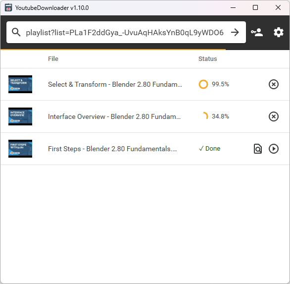
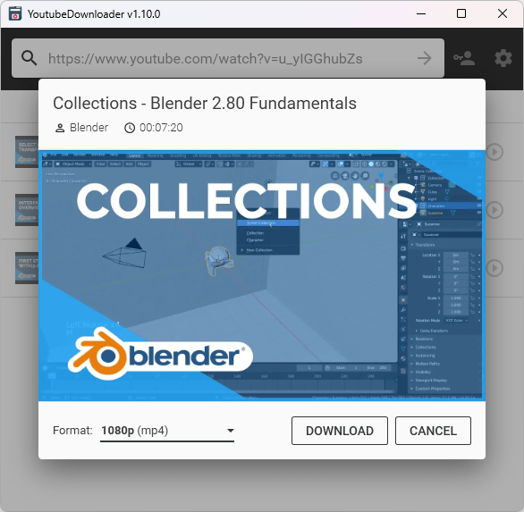
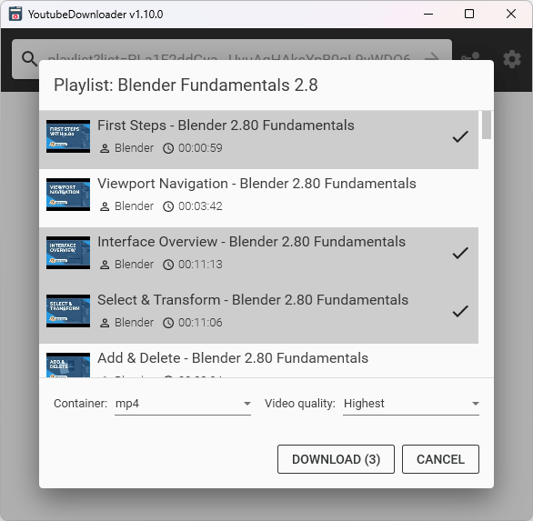

# YoutubeDownloader

> 🟡 **Project status**: maintenance mode[[?]](https://github.com/Tyrrrz/.github/blob/master/docs/project-status.md)

**YoutubeDownloader** is an application that lets you download videos from YouTube.
You can copy-paste URL of any video, playlist or channel and download it directly to a format of your choice.
It also supports searching by keywords, which is helpful if you want to quickly look up and download videos.

This application uses [**YoutubeExplode**](https://github.com/Tyrrrz/YoutubeExplode) under the hood to interact with YouTube.

## Download

- 🟢 **[Stable release](https://github.com/Tyrrrz/YoutubeDownloader/releases/latest)**
- 🟠 [CI build](https://github.com/Tyrrrz/YoutubeDownloader/actions/workflows/main.yml)

## Features

- Download videos by URL
- Download videos from playlists or channels
- Download videos by search query
- Selectable video quality and format
- Automatically embed subtitles
- Automatically inject media tags

## Screenshots

