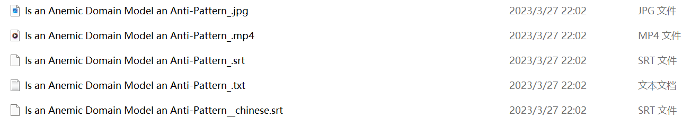
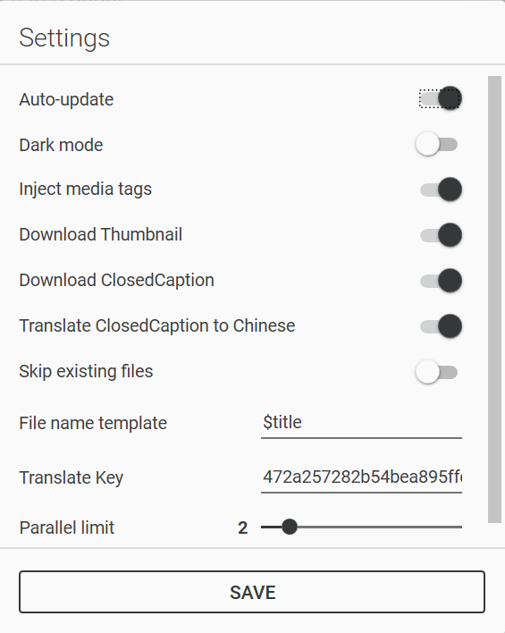

# YoutubeDownloader

[英文](Readme_EN.md)

> 🟡 **项目状态**: 维护状态[[?]](https://github.com/Tyrrrz/.github/blob/master/docs/project-status.md)

**YoutubeDownloader**是一个可以从YouTube下载视频的应用程序。您可以复制粘贴任何视频、播放列表或频道的 URL，并将其直接下载为你选择的格式。如果你想快速查找和下载视频，它还支持按关键字搜索。

这个程序使用 [**YoutubeExplode**](https://github.com/Tyrrrz/YoutubeExplode) 库与Youtube进行交互。
> 📝 想详细了解 YouTube 的幕后工作原理?
> 查看 [Reverse-Engineering YouTube: Revisited](https://tyrrrz.me/blog/reverse-engineering-youtube-revisited).

## 使用条款[[?]](https://github.com/Tyrrrz/.github/blob/master/docs/why-so-political.md)

通过出于任何目的以任何形式或形式使用本项目或其源代码，您同意**默示同意**以下所有声明：

- 你**谴责俄罗斯及其对乌克兰的军事侵略**
- 你**承认俄罗斯是非法入侵主权国家的占领者**
- 你**支持乌克兰的领土完整，包括它对暂时占领的克里米亚和顿巴斯领土的主张**
- 你**拒绝俄罗斯国家宣传延续的虚假叙述**

要了解有关这场战争的更多信息以及您可以如何提供帮助，[单击此处](https://tyrrrz.me/ukraine)。 Glory to Ukraine! 🇺🇦

## 下载

- 🟢 **[Stable release](https://github.com/SinnoSong/YoutubeDownloader/releases/latest)**
- 🟠 [CI build](https://github.com/SinnoSong/YoutubeDownloader/actions/workflows/main.yml)

## 功能

- 通过 URL 下载视频
- 从播放列表或频道下载视频
- 通过搜索查询下载视频
- 可选择的视频质量和格式
- 自动嵌入字幕
- 自动注入媒体标签

新增功能：

- 下载视频封面
- 下载字幕文件（当字幕文件没有中文时，自动翻译字幕文件）
- 自动翻译标题和视频简介
  - 使用微软（或百度）翻译API，需自行注册Azure（或百度翻译API）账号并创建对应服务
  - 百度翻译需要使用**AppId**和**Key**，微软翻译只需要使用**Key**。如果**AppId不为空**则使用百度翻译，反之使用微软翻译
  - 如果标题中的中文超过60%，则不会翻译视频标题、简介、字幕文件

注：

- 新增功能需要进入设置页面设置

## 截图

