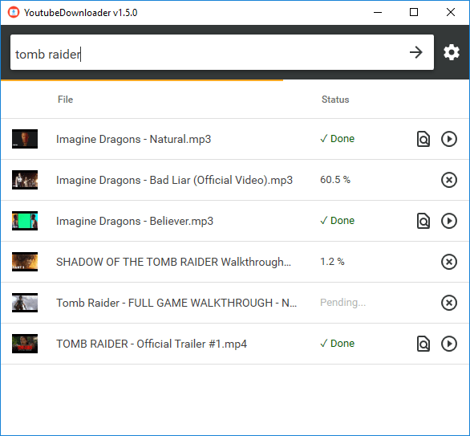
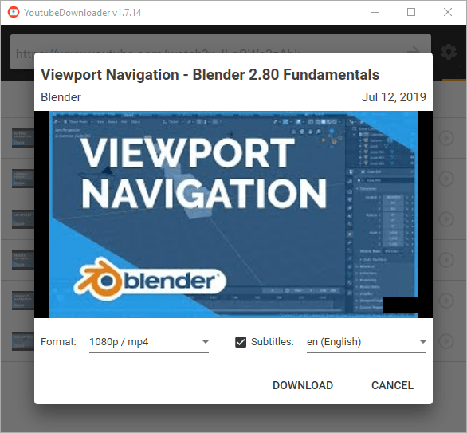

# YoutubeDownloader

⚠️ **Project status: maintenance mode** (bug fixes only).

YoutubeDownloader is an application that lets you download videos from YouTube. You can copy-paste URL of any video, playlist or channel and download it directly to a format of your choice. It also supports searching by keywords, which is helpful if you want to quickly look up and download videos.

This application uses [YoutubeExplode](https://github.com/Tyrrrz/YoutubeExplode) under the hood to interact with YouTube.

## Download

- **[Latest release](https://github.com/Tyrrrz/YoutubeDownloader/releases/latest)**
- [CI build](https://github.com/Tyrrrz/YoutubeDownloader/actions)

**Important**: This application requires **.NET Core v3.1** runtime in order to run. To install the runtime, find the suitable download option below:

- [Windows x64](https://dotnet.microsoft.com/download/dotnet/thank-you/runtime-desktop-3.1.10-windows-x64-installer)
- [Windows x86](https://dotnet.microsoft.com/download/dotnet/thank-you/runtime-desktop-3.1.10-windows-x86-installer)

## Features

- Supports single videos, playlists, channels, and search queries
- Variety of output formats: mp4, webm, mp3, ogg
- Selectable video quality
- Multiple downloads in parallel with progress reporting and cancellation
- Automatic media tagging for audio downloads

## Screenshots

